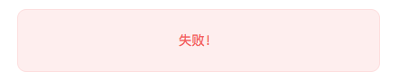

#### Loading
> 消息盒子为项目提供的是成功、警告、提示、错误的提醒，具体表现如下:

##### 参数
| 参数 | 说明 | 类型 | 可选值 | 默认值 |
| :------: | :------: | :------: | :------: | :------: |
| type | 消息框类型 | string | normal、error、success、warning| normal
| message | 消息内容 | string | - | - |
| duration | 时间(从显示到消失时间，单位ms) | number | - | 2500 |
| onClose | 消息框消失时的回调函数 | function | - | - |
| showIcon | 是否显示消息框中的图标 | boolean | true、false | true |
