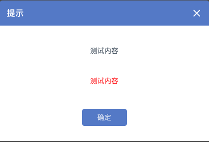

#### 消息盒子(Message Box)
> 消息盒子为项目提供的是弹窗类的提醒，例如确认、提示等，具体表现如下:

##### Prop
| 名称 | 说明 | 类型 | 可选值 | 默认值 |
| :------: | :------: | :------: | :------: | :------: |
| title | 消息弹窗标题 | string | - | - |
| content | 消息内容 | string | - | - |
| appendixContent | 附加说明 | string | - | - |
| importantClass | 附加说明是否标红 | bool | - | - |

##### emit事件
| 名称 | 说明 | 类型 | 可选值 | 默认值 |
| :------: | :------: | :------: | :------: | :------: |
| closeMessageBox | 关闭弹窗回调函数 | event | - | - |
| confirmMessageBox | 确认按钮回调函数 | event | - | - |
